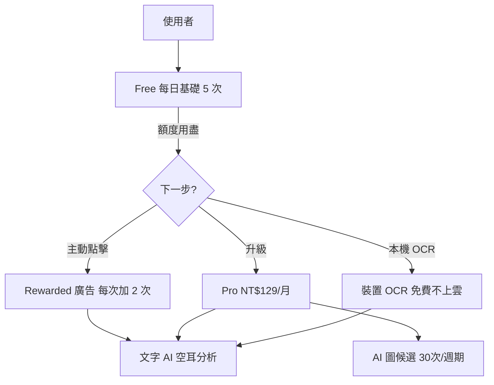
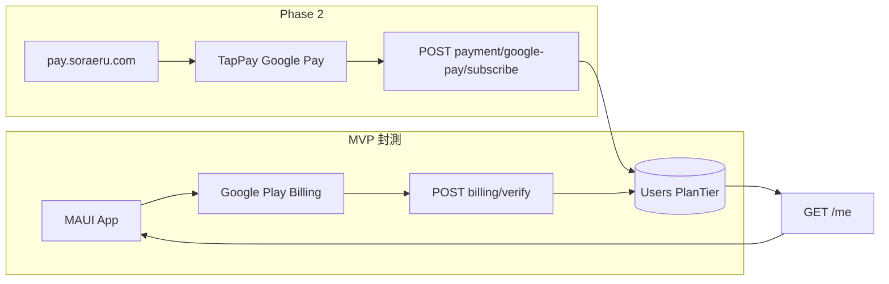
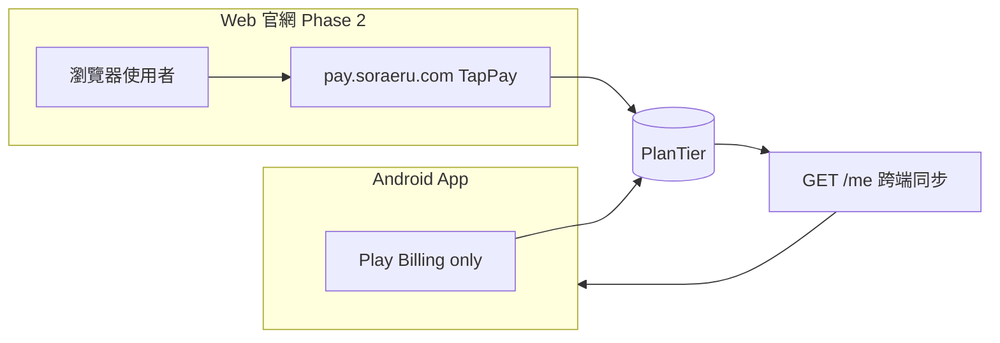
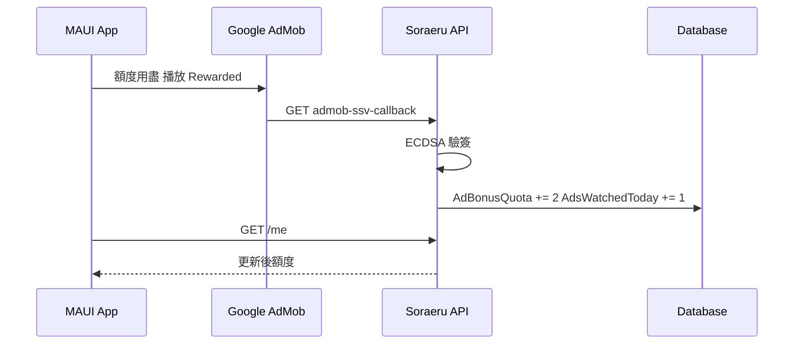
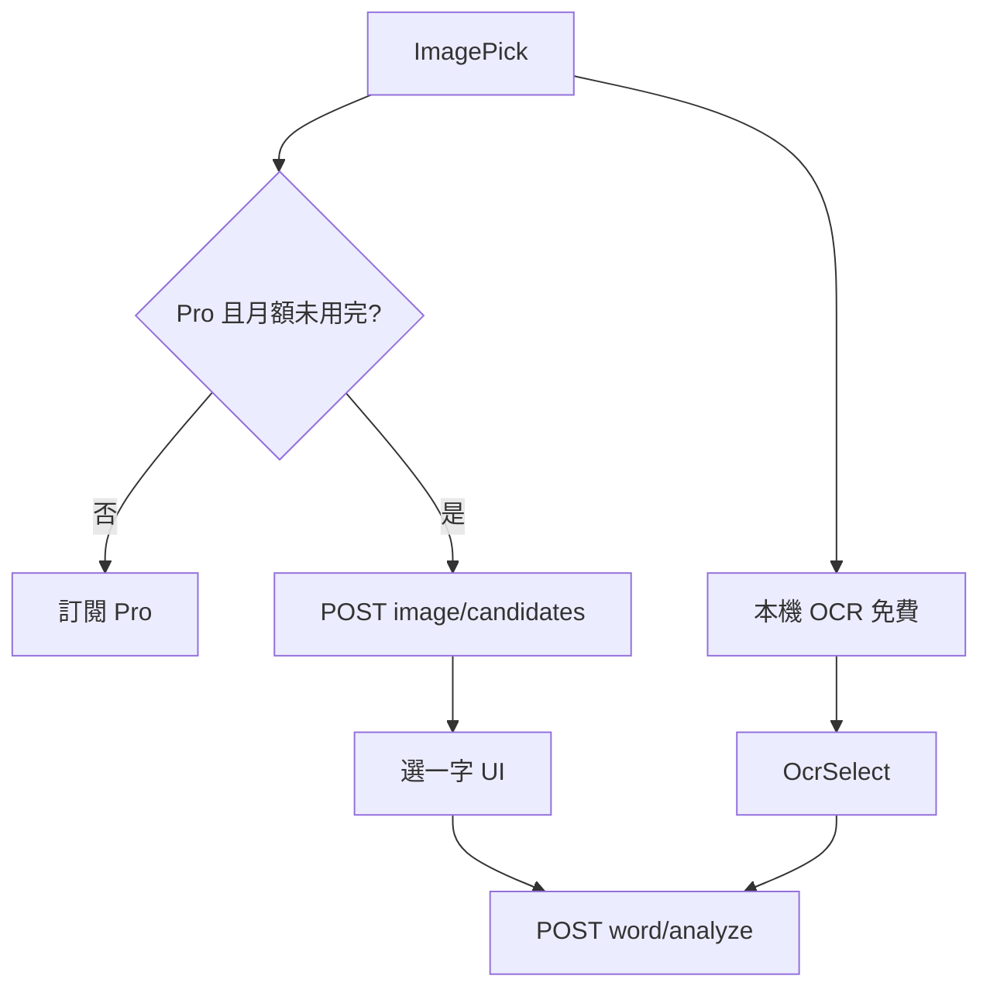
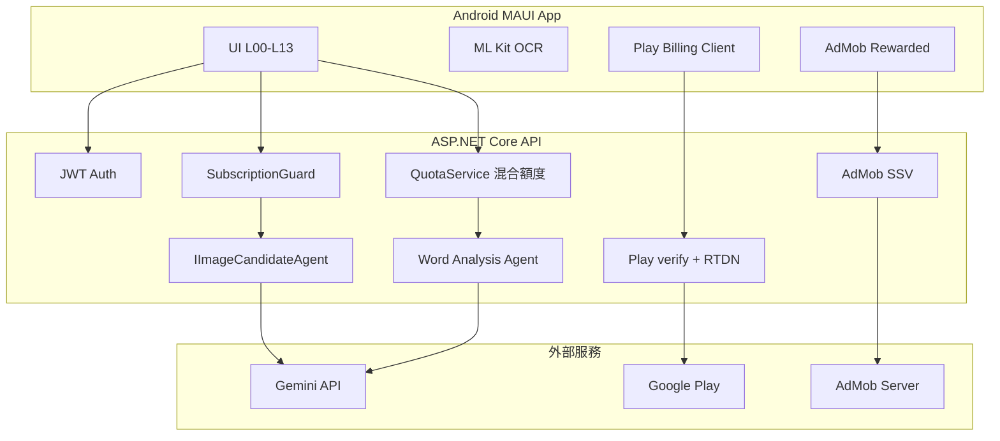
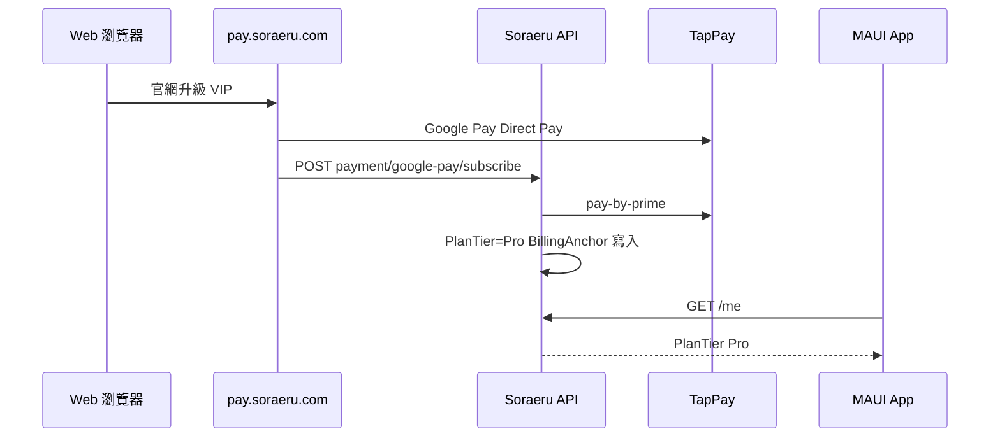

# Soraeru / 空耳聯合國 — 混合獲利模式與系統整合企劃書（整合版）

**文件版本：** v2.1（整合 CMO v1.3 + 工程方案 + CMO 合規／邊界案例）  
**核心定位：** 輕量無痛入門、獎勵廣告變現、Pro 訂閱高 LTV、AI 圖 Pro 專屬  
**圖表：** 本文流程圖均為 **Mermaid** 原始碼，請自行渲染後插入對外簡報／Docx。

**核心團隊：**

| 角色 | 人員 | 職責摘要 |
|---|---|---|
| CTO / 技術總監 | **ASHTON** | 額度中介、AdMob SSV、Play Billing、Vision API、資料庫一致性 |
| CMO / 行銷總監 | **Ben** | AdMob 單元、訂閱／缺額度引導 UI、短影音與轉換漏斗 |

**權威來源對照：**

| 文件 | 路徑 |
|---|---|
| 本整合版（**以本檔為準**） | `docs/specs/hybrid-monetization-integrated.md` |
| CMO 原始 v1.3 | `docs/specs/hybrid-monetization-cmo-v1.3.md`（歷史參考） |
| ADR 0011（架構決策） | `docs/adr/0011-hybrid-monetization-pro-ai-image.md` |
| 領域詞彙 | `docs/glossary.md`（Monetization 章節） |
| Play 訂閱工程指南 | `docs/Soraeru Google Play 訂閱與點數串接指南 for .Net.docx`（僅訂閱段落） |
| 實作計畫 | `.cursor/plans/ai圖分析訂閱_22f89ed4.plan.md` |

**v2.0 相對 CMO v1.3 主要變更：**

- 採用 **純訂閱制**，**不實作 Sora-Points 點數包**
- 新增 **Pro 專屬 AI 圖分析**（30 次/月）；Free／廣告加額皆不可用
- 金流 **雙通道**：MVP **Play Billing** + Phase 2 **Web TapPay**
- Pro 新增：**無限重產**（Free ≤3）、年訂 NT$990
- CTO 署名統一為 **ASHTON**
- 圖表改 **Mermaid**（不內嵌點陣圖）

**v2.1 相對 v2.0 主要變更（CMO 審閱）：**

- **Play Anti-Steering**：App 內禁止導外 TapPay／比價文案；Web TapPay 僅供瀏覽器／官網
- **AI 圖月額**：改為 **訂閱週期錨點日（Billing Anchor）** 重置，非自然月
- **日切時區**：每日額度以 **Asia/Taipei 00:00** 重置
- **單字卡降級**：超限 **唯讀鎖定**，舊卡可查不可新增
- **SSV 延遲**：App 看完廣告後 **輪詢 `/me`** 再允許分析
- **Vision 失敗**：候選字 **0 筆不扣** AI 圖月額
- **錯誤碼**：標準化 `QUOTA_*` 與引導 Payload

---

## 1. 核心獲利架構（Executive Summary）

Soraeru 採 **「三階梯混合漏斗」**：每日免費配額 → 獎勵廣告贈額 → Pro VIP 訂閱；並在 Pro 層疊加 **AI 圖片候選**（工程差異化）。



| 階梯 | 每日分析 | 單字卡上限 | 廣告 | 費用 |
|---|---|---|---|---|
| **Free** | 基礎 **5 次/日**（**台北 00:00** 重置） | **30 張** | 無強制插頁 | NT$ 0 |
| **Ad-Supported** | 基礎 5 + 獎勵廣告最多 **+6**（3 則×2）→ 日上限 **11** | **50 張** | 僅 **Rewarded Video**（使用者主動） | NT$ 0 |
| **Pro VIP** | **無限**（軟上限 **300/日**） | **無限** | **零廣告** | **NT$ 129/月** 或 **NT$ 990/年** |

**Pro 額外權益（工程補充）：**

- 同字 **無限重新產生**（Free ≤3 次；Pro 冷卻 15～30 秒防濫用）
- **AI 分析圖片** **30 次/訂閱週期**（僅 Pro；於 **Billing Anchor** 續訂日重置）
- 雲端備份／同步完整版（第二階段：匯出、學習統計）

---

## 2. 方案規則矩陣（整合定案）

| 功能 | Free | Ad 加額後（同日） | Pro |
|---|---|---|---|
| 文字 AI 分析 | 5 次/日 | 最多 +6 → 日上限 11 | 無限（軟上限 300/日） |
| 同字重新產生 | ≤3 次 | 同 Free | 無限（冷卻 15～30s） |
| 本機 OCR 選字 | ✓ | ✓ | ✓ |
| **AI 分析圖片** | **✗** | **✗** | **30 次/訂閱週期** |
| 單字卡上限 | 30 張 | 50 張 | 無限 |
| 廣告體驗 | 無強制插頁；可選獎勵廣告 | 同左 | 零廣告 |

### 2.1 與現行程式對齊備註

**Free 每日基礎額度（雙表）：**

| 情境 | Free 日額 | 備註 |
|---|---|---|
| **上線定案** | **5** | 對齊 CMO 三階梯漏斗 |
| **封測／現行程式** | **20** | 現行 `AppConstants.FreeDailyQuota`；設定頁標 beta；**上線前改為 5** |

| 項目 | CMO/整合定案 | 現行程式 | 行動 |
|---|---|---|---|
| Pro 軟上限 | **300/日** | — | 實作時寫入 `QuotaService` |
| 卡片上限 | 30/50/無限 | 未實作 | 新票券 |

### 2.2 降級與邊界策略（CMO v2.1）

**單字卡上限降級（Read-Only 鎖定）：**

當 Pro 過期降回 Free，或同日 Ad 加額失效後有效上限變為 30 張，若本機／雲端已有卡片 **超過當前上限**：

| 行為 | 允許 | 禁止 |
|---|---|---|
| 查閱、複習、播放既有卡片 | ✓ | — |
| 新增單字卡 | — | ✓（回 `NOTEBOOK_LIMIT_EXCEEDED`） |
| 編輯／刪除既有卡片 | ✓（刪除後若低於上限可再新增） | — |

`GET /me` 回傳 `NotebookCardCount`、`NotebookCardLimit`、`NotebookAddBlocked: bool`，供 App 顯示「刪除至 N 張以下或升級 Pro」。

**每日額度日切：**

- 基準時區：**Asia/Taipei（UTC+8）每日 00:00**
- 後端實作等價：以台北日期的 `yyyy-MM-dd` 寫入 `LastQuotaResetDate`；或以 UTC **前一日 16:00** 為界（= 台北 00:00）
- **禁止**以 UTC 00:00 直接對台灣使用者重置（避免 07:00–08:00 通勤時額度未刷新）

---

## 3. 單位經濟與定價

### 3.1 訂閱商品

| 商品 ID | 牌價 |
|---|---|
| `soraeru_pro_monthly` / `pro_monthly` | NT$ **129**/月 |
| `soraeru_pro_yearly` | NT$ **990**/年（≈ NT$ 82.5/月） |

### 3.2 成本與毛利（校準用）

> CMO v1.3 以 Gemini 1.5 Flash／~300 tokens 試算，**偏低估**。工程實作使用 **gemini-3.6-flash** + 長 system prompt；應以 `LlmUsage` 表 P95 校準。

| 行為 | 粗估單次成本 |
|---|---|
| 文字空耳分析 | ~NT$ 0.35～0.45 |
| AI 圖候選 + 選字後分析 | ~NT$ 0.45～0.55 |
| 獎勵廣告單次收益（台灣 Rewarded） | ~NT$ 0.48～0.80（CMO 取 NT$ 0.60） |

**看廣告用戶（日滿 11 次）：** 成本 ~NT$ 0.011/日；3 則廣告收益 ~NT$ 1.80/日 → 淨利正向（CMO 模型仍成立，但需實測 eCPM）。

**Pro 用戶（NT$ 129/月）：** Play 抽成後實收約 ×85%；重度使用需靠 **300/日軟上限** 與 **AI 圖 30/月** 控成本。

### 3.3 刻意不做

- Sora-Points 點數包、消耗品 IAP
- Free／廣告路徑解鎖 AI 圖
- 強制 banner／插頁（違反 Free 乾淨體驗）

---

## 4. 金流策略（雙通道、單一權益）

兩條路徑皆寫入 `Users.PlanTier` + `SubscriptionExpiry`；App 只認 `GET /api/v1/me`。



| 通道 | 負責 | 時程 | 手續費參考 |
|---|---|---|---|
| **A. Google Play Billing** | ASHTON（CTO） | MVP／封測 | ~15% 訂閱費 |
| **B. Web TapPay** | Ben + ASHTON | Phase 2 | ~2.4～2.8%（CMO） |

**App 內升級（MVP／上架）：** 僅 **Google Play Billing** 訂閱流程。

### 4.1 Play 商店合規（Anti-Steering · 必守）

| 規則 | 說明 |
|---|---|
| **App 內禁止導外付費** | Android App **不得**放置 `pay.soraeru.com` 連結、官網訂閱入口、或「手續費更低／比 App 便宜」等比價文案 |
| **數位內容須 Play Billing** | Pro 訂閱屬 Digital Goods/Services，須符合 Google Play **Payments Policy**／**Anti-Steering** |
| **Web TapPay 適用範圍** | Phase 2 僅在 **Web 官網／瀏覽器學習端**（桌面或行動瀏覽器）提供；使用者自行開啟官網訂閱後，權益經 `GET /me` 同步至 App |
| **違規風險** | App 內明示導外較便宜方案 → 審查退件或下架 |



---

## 5. 廣告變現（Rewarded + SSV）

### 5.1 規則

- 完整觀看 15～30s 獎勵影音 → **+2 次**分析額度
- 每日最多 **3 則**（`AdsWatchedToday` ≤ 3）
- **僅額度用盡時**出現「看廣告 +2 次」與「升級 VIP」並列（Ben UX）

### 5.2 AdMob SSV 流程



- 端點：`GET /api/v1/ads/admob-ssv-callback`
- 稽核表：`AdRewardLogs`
- Pro：**不載入**任何廣告 SDK（`IAdEligibilityService`）

### 5.3 SSV 非同步延遲與 App 防禦

AdMob SSV 為 **Webhook 非同步**；使用者看完廣告到後端入庫常有 **數百毫秒～1 秒** 延遲。

| 步驟 | App 行為 |
|---|---|
| 1 | `onUserEarnedReward` 後顯示 **Loading**（「正在確認獎勵…」） |
| 2 | **輪詢** `GET /me`（建議 300ms 間隔、最多 5 次或 3 秒 timeout） |
| 3 | `AdBonusQuota` 或 `RemainingDailyQuota` 增加後才關閉 Loading、允許發起分析 |
| 4 | 逾時仍無加額 → 提示「獎勵確認中，請稍後再試」；**禁止**立刻重播廣告刷額 |

Phase 2 可改 WebSocket／SSE 推送；MVP 以輪詢為準。

---

## 6. AI 圖片分析（Pro 專屬 · 工程新增）

### 6.1 產品規則

- **僅有效 Pro 訂閱**可用；Free 與廣告加額路徑皆 **不可用**
- **固定 30 次/訂閱週期**；用完回 `AI_IMAGE_QUOTA_EXCEEDED`，等 **下一個 Billing Anchor** 重置
- **兩段式管線**：Vision 產候選字 → 使用者選一字 → 既有 `POST /word/analyze` 產空耳

### 6.1.1 AI 圖月額重置（Billing Anchor · 非自然月）

| 項目 | 定案 |
|---|---|
| **重置基準** | 使用者 **訂閱週期錨點日**（Billing Anchor Date），與 Play／TapPay 扣款週期對齊 |
| **範例** | 8/15 訂閱 → 額度於 8/15–9/14 可用 30 次；9/15 續訂成功後重置為 30 |
| **禁止** | 自然月 1 號重置（避免 8/30 訂閱拿 30 次、9/1 又刷 30 次的漏洞） |
| **欄位** | `SubscriptionBillingAnchorAt`（UTC）、`AiImageCountInPeriod`、`AiImagePeriodEndAt` |

續訂失敗或 Pro 過期 → 不降回 Free 額外 AI 圖次數；僅在有效 Pro 期間累計。

### 6.2 流程



### 6.3 隱私邊界

| 路徑 | 原圖是否上雲 |
|---|---|
| 本機 OCR | **否**（裝置端 ML Kit） |
| AI 圖候選 | **是**（須 UI 明示；處理後不落盤長期保存） |

### 6.4 Vision 失敗與額度扣除（成本防禦）

`POST /image/candidates` 扣減 AI 圖週期額度的時機：

| 情境 | 是否扣 1 次 AI 圖額度 | HTTP／錯誤碼 |
|---|---|---|
| Vision 回傳 **≥1** 候選字 | **是**（成功回 200 時 commit） | 200 |
| Vision 回傳 **0** 候選（空白圖／無文字） | **否**（rollback 或不預扣） | `IMAGE_UNREADABLE` |
| 圖片格式無效、過大、非圖片 | **否** | `IMAGE_INVALID` |
| Pro 額度已用完 | — | `AI_IMAGE_QUOTA_EXCEEDED` |
| 非 Pro | — | `SUBSCRIPTION_REQUIRED` |

**實作建議：** 先呼叫 Vision，僅在 `candidates.length >= 1` 時遞增 `AiImageCountInPeriod`；或採預扣 + 失敗時 transaction rollback。

---

## 7. 系統架構



**技術棧（以 repo 現況為準）：**

| 層 | 選型 |
|---|---|
| App | .NET MAUI (Android) |
| API | ASP.NET Core Minimal API |
| DB | SQLite（Railway Volume；CMO 原稿寫 Azure SQL，可後續遷移） |
| LLM | gemini-3.6-flash（OpenAI-compatible） |
| OCR | ML Kit（裝置端） |
| 廣告 | AdMob Rewarded + SSV |
| 訂閱 MVP | Google Play Billing + Android Publisher API |

---

## 8. 資料庫設計（整合 Schema）

### 8.1 Users（擴充）

| 欄位 | 型別 | 說明 |
|---|---|---|
| PlanTier | string | `Free` \| `Pro` |
| SubscriptionExpiry | datetime UTC | VIP 到期 |
| SubscriptionBillingAnchorAt | datetime UTC | 訂閱週期錨點（AI 圖額度重置基準） |
| DailyFreeQuota | int | 今日免費額度剩餘（基礎 5） |
| AdBonusQuota | int | 今日廣告贈送剩餘 |
| AdsWatchedToday | int | 今日已看獎勵廣告（≤3） |
| LastQuotaResetDate | date | **台北日曆日** `yyyy-MM-dd`（Asia/Taipei 00:00 日切） |
| AiImageCountInPeriod | int | 當前訂閱週期 AI 圖已用次數（Pro） |
| AiImagePeriodEndAt | datetime UTC | 當前 AI 圖額度週期結束（= 下次 Anchor 或 SubscriptionExpiry） |

### 8.2 其他表（沿用 CMO）

- `WordCards`（複合唯一：UserId + SourceLanguage + NormalizedText）
- `Payments` + `CardToken`（Phase 2 TapPay）
- `AdRewardLogs`（SSV 稽核）
- `ProcessedPurchases`（Play 訂閱冪等）
- `LlmUsage`（工程：token 與成本追蹤）

### 8.3 額度消耗順序

1. Pro 未過期 → 文字分析不扣日額（計入 300/日軟上限）
2. 否則先扣 `DailyFreeQuota`，再扣 `AdBonusQuota`
3. 皆無 → `429` + 引導（看廣告／升級 Pro）
4. AI 圖 → 僅 `SubscriptionGuard`（Pro + 週期額度 30）；0 候選不扣

---

## 9. API 規格摘要

Base: `/api/v1`

| 方法 | 路徑 | 說明 |
|---|---|---|
| GET | `/me` | PlanTier、各額度、RemainingAiImageQuota、NotebookCardLimit |
| POST | `/word/analyze` | 混合額度扣減 |
| GET | `/ads/admob-ssv-callback` | SSV 驗簽 + 加額 |
| POST | `/billing/verify` | Play 訂閱驗證（僅 Subscription） |
| POST | `/billing/rtdn-webhook` | 續訂／過期／撤銷 |
| POST | `/payment/google-pay/subscribe` | Phase 2 TapPay |
| POST | `/image/candidates` | Pro + 週期額度；multipart 圖片；≥1 候選才扣額 |

### 9.1 標準錯誤碼與引導 Payload

所有 `4xx` 回應建議採統一 envelope：

```json
{
  "error": "QUOTA_DAILY_EXCEEDED",
  "message": "今日分析額度已用盡",
  "guidance": {
    "canWatchAd": true,
    "adsRemainingToday": 2,
    "canUpgradePro": true
  }
}
```

| 錯誤碼 | HTTP | 情境 | App 引導 |
|---|---|---|---|
| `QUOTA_DAILY_EXCEEDED` | 429 | 日額（含廣告加額）用盡 | 「看廣告 +2」+「升級 Pro」 |
| `QUOTA_AD_AVAILABLE` | 429 | 基礎 5 次用盡、尚可看廣告 | 優先顯示 Rewarded 按鈕 |
| `QUOTA_AD_MAXED` | 429 | 今日 3 則廣告已滿 | 僅顯示升級 Pro |
| `SUBSCRIPTION_REQUIRED` | 403 | 非 Pro 呼叫 AI 圖 | Pro Paywall |
| `AI_IMAGE_QUOTA_EXCEEDED` | 429 | Pro 週期 30 次用盡 | 「下個週期 YYYY-MM-DD 重置」 |
| `IMAGE_UNREADABLE` | 422 | Vision 0 候選 | 提示重拍／改本機 OCR；**不扣** AI 圖額度 |
| `IMAGE_INVALID` | 400 | 非圖片／過大 | 請重新選圖 |
| `NOTEBOOK_LIMIT_EXCEEDED` | 409 | 單字卡超上限 | 唯讀提示；引導刪除或升級 Pro |

**AI 圖專用（摘要）：** `SUBSCRIPTION_REQUIRED`、`AI_IMAGE_QUOTA_EXCEEDED`、`IMAGE_UNREADABLE`、`IMAGE_INVALID`

---

## 10. 網頁 TapPay 訂閱流程（Phase 2 · 僅 Web）

> **App 內不提供此流程連結**（見 §4.1 Anti-Steering）。使用者於 **瀏覽器** 開啟官網自行訂閱；App 僅在下次 `GET /me` 同步權益。



---

## 11. 資安與隱私

1. **本機 OCR**：原圖不上傳（CMO §11）
2. **AI 圖**：上雲前須告知；建議壓縮至 ~1024px；不長期存原圖
3. **秘密**：LLM Key、AdMob、Play Service Account、TapPay Key → 僅伺服器環境變數
4. **SSV**：必須 ECDSA 伺服器驗簽，禁止僅信客戶端 callback
5. **HTTPS**：全站 TLS

---

## 12. 行銷時程（CMO · 工程配合）

| 階段 | 行銷（Ben） | 工程（ASHTON） |
|---|---|---|
| W11–14 封測 | 12 人 × 14 天封閉測試 | 混合額度、SSV、Play 訂閱可測 |
| W15–18 上架 | 短影音、PTT | Pro Paywall、Vision API、Me UI |
| W19+ | UGC 空耳徵稿、異業合作 | 推薦碼 Phase 2 |

### RACI（摘錄）

| 模組 | ASHTON | Ben |
|---|---|---|
| 後端／AI／MAUI | **A/R** | C |
| AdMob + SSV | **A/R** | **A/R** |
| Play Billing | **A/R** | C |
| Web TapPay | **A/R** | **A/R** |
| 訂閱／缺額度 UI | C | **A/R** |
| 封測營運 | S | **A/R** |
| 短影音／異業 | C | **A/R** |

---

## 13. 實作順序（工程）

1. 分支 `feature/ai-image-candidates-billing`
2. Glossary + ADR（混合額度、雙金流、AI 圖 Pro 專屬）
3. 混合額度 + `GET /me` 擴充
4. AdMob SSV + `AdRewardLogs`
5. Play Billing verify + RTDN
6. `POST /image/candidates` + App AI 圖流程
7. App Paywall／額度用盡 UI
8. Phase 2：TapPay Web + Worker
9. Pro 加值：匯出、統計

---

## 14. 測試清單

- [ ] Free 5 + 廣告 +6 = 日上限 11
- [ ] Pro 300/日軟上限；過期降回 Free
- [ ] SSV 偽造拒絕；每日 3 則上限
- [ ] Play 訂閱／恢復／RTDN 過期
- [ ] Free 不可 AI 圖；Pro 月額 30
- [ ] Pro 零廣告；Free 僅獎勵廣告路徑
- [ ] 卡片上限 30/50/無限；**降級唯讀鎖定**超額不可新增
- [ ] 本機 OCR 仍不上雲
- [ ] **台北 00:00** 日切（非 UTC 00:00 使用者體感）
- [ ] AI 圖 **Billing Anchor** 重置；非自然月漏洞
- [ ] Vision **0 候選不扣** AI 圖額度
- [ ] SSV 後 **輪詢 /me** 再加額成功才分析
- [ ] App **無** pay.soraeru.com 導外連結／比價文案
- [ ] 錯誤碼 `QUOTA_*` 引導 Payload 正確彈窗

---

## 15. 修訂紀錄

| 版本 | 日期 | 說明 |
|---|---|---|
| v1.3 | CMO | Ben 原始混合獲利規劃書 |
| v2.0 | 2026-08-31 | 整合工程方案：AI 圖 Pro、無點數、雙金流、ASHTON 署名、Mermaid 圖 |
| v2.1 | 2026-08-31 | CMO 合規：Anti-Steering、Billing Anchor、台北日切、降級唯讀、SSV 輪詢、Vision 不扣額、錯誤碼 |

---

*本文件由 Soraeru 核心團隊（ASHTON & Ben）對齊審定；**實作與上架以 v2.1 整合版為準**。*
